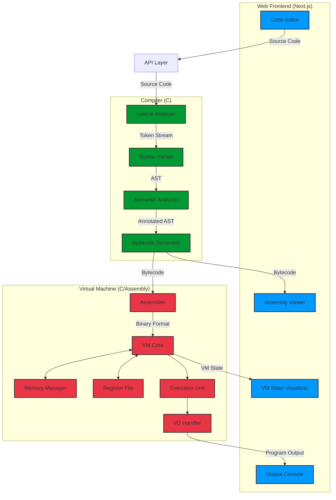

# Axiom

**Axiom** is a simple programming language designed for educational purposes, particularly for teaching programming concepts to beginners. It is a high-level language that compiles to a custom bytecode format, which is then executed by **ANVIL** (Assembly-Native Virtual Instruction Language), a virtual machine implemented in C and Assembly. The language is designed to be easy to learn and understand, making it an ideal choice for those who are new to programming.

The plan is to later compile this project to **WebAssembly (WASM)** using Emscripten, allowing it to run in web browsers. This will enable the execution of Axiom code directly in the browser, making it accessible and easy to use for educational purposes.

## Table of Contents
- [Features](#features)
- [Architecture](#architecture)
- [Building](#building)
- [License](#license)
- [Contributing](#contributing)

## Features
- Simple and easy-to-understand syntax
- Basic arithmetic operations: addition, subtraction, multiplication, and division
- Variable assignments and usage
- Control flow: if statements and loops

## Architecture
The project is divided into three main components:
1. **Axiom**: The programming language itself, which is designed to be simple and easy to learn. It includes a lexer, parser, semantic analyzer, and code generator.
2. **ANVIL**: The virtual machine that executes the compiled bytecode. It is implemented in C and Assembly, providing a low-level execution environment for Axiom programs.
3. **Web Frontend**: A web-based interface built with **Next.js** that allows users to write, compile, and execute Axiom code in their browsers. The frontend communicates with the backend compiler and VM to provide a seamless user experience.



### Compiler Pipeline

```mermaid
flowchart LR
    Input[Source Code] --> Lexer
    
    subgraph "Lexical Analysis"
        Lexer[Lexer] -->|Token Stream| TokenStream[Token Stream]
    end
    
    TokenStream --> Parser
    
    subgraph "Syntax Analysis"
        Parser[Parser] -->|Parse Tree| SyntaxTree[Abstract Syntax Tree]
    end
    
    SyntaxTree --> Semantic
    
    subgraph "Semantic Analysis"
        Semantic[Semantic Analyzer] -->|Annotated AST| AnnotatedAST[Annotated AST]
    end
    
    AnnotatedAST --> CodeGen
    
    subgraph "Code Generation"
        CodeGen[Code Generator] -->|Bytecode| Assembly[Bytecode]
    end
    
    classDef phase fill:#cc00cc,stroke:#333,stroke-width:2px;
    classDef data fill:#ff0000,stroke:#333,stroke-width:1px;
    
    class Lexer,Parser,Semantic,CodeGen phase;
    class Input,TokenStream,SyntaxTree,AnnotatedAST,Assembly data;
```

## Building
To build the project, you need to have **CMake** and a C compiler installed&mdash;preferably **GCC** (GNU C Compiler). Follow these steps:

> [!WARNING]
> Has not been tested on Windows yet.

1. Clone the repository:
   ```bash
    git clone https://github.com/1neskk/SPL.git
    cd SPL
   ```
2. Run the build command
Linux:
   ```bash
   make build
   ```
    Windows:
    ```bash
        mkdir build
        cd build
        cmake ..
        cmake --build .
    ```
3. Open the resulting project file in your preferred IDE or run the executable directly from the `build` directory.

## License
This project is licensed under the **MIT License**. See the [LICENSE](LICENSE) file for details.

## Contributing
This project is currently not open for contrubutions. However, it will be open for contributions in the future. If you have any suggestions or improvements, feel free to open an issue or contact me directly.
